# Benchmarks

---

### cmp

**/data/buffers/1-short.txt**

| Key         | Value                        |
| ----------- | ---------------------------- |
| Completions | 77  |
| Mean        | 62ms |
| STD         | 36ms  |
| Q0          | 1ms   |
| Q50         | 82ms  |
| Q95         | 84ms  |
| Q100        | 121ms |

---

### cmp

**/data/buffers/2-medium.txt**

| Key         | Value                        |
| ----------- | ---------------------------- |
| Completions | 81  |
| Mean        | 79ms |
| STD         | 25ms  |
| Q0          | 1ms   |
| Q50         | 84ms  |
| Q95         | 94ms  |
| Q100        | 134ms |

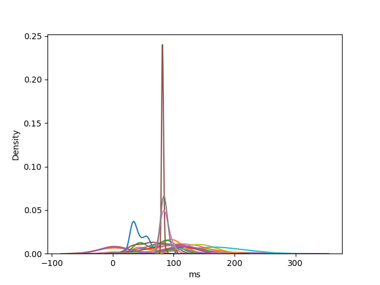

---

### cmp

**/data/buffers/3-long.txt**

| Key         | Value                        |
| ----------- | ---------------------------- |
| Completions | 87  |
| Mean        | 80ms |
| STD         | 28ms  |
| Q0          | 1ms   |
| Q50         | 84ms  |
| Q95         | 100ms  |
| Q100        | 197ms |

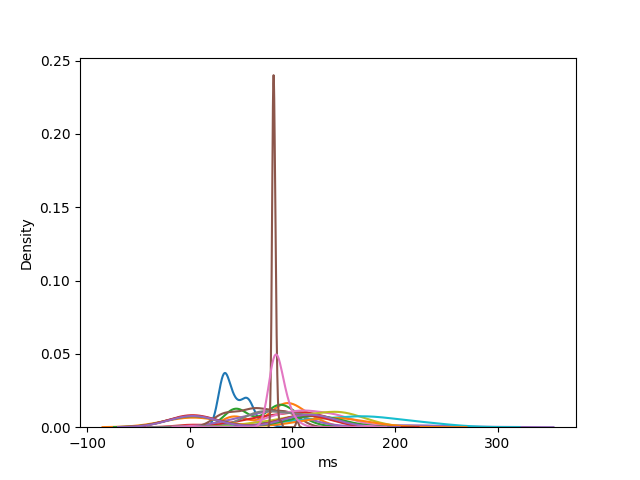

---

### cmp

**/data/lsp/coq_nvim/coq/server/edit.py**

| Key         | Value                        |
| ----------- | ---------------------------- |
| Completions | 101  |
| Mean        | 107ms |
| STD         | 56ms  |
| Q0          | 1ms   |
| Q50         | 83ms  |
| Q95         | 239ms  |
| Q100        | 312ms |

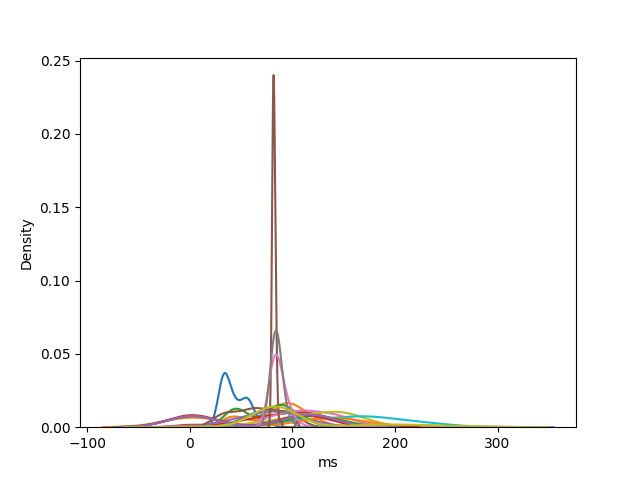

---

### cmp

**/data/lsp/create-react-app/packages/create-react-app/createReactApp.js**

| Key         | Value                        |
| ----------- | ---------------------------- |
| Completions | 97  |
| Mean        | 71ms |
| STD         | 63ms  |
| Q0          | 1ms   |
| Q50         | 82ms  |
| Q95         | 186ms  |
| Q100        | 323ms |

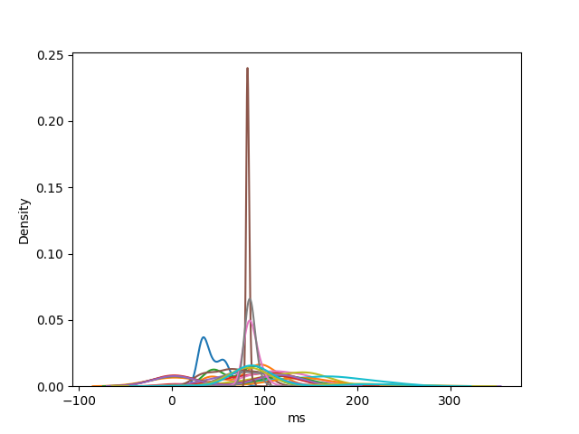

---

### coc

**/data/buffers/1-short.txt**

| Key         | Value                        |
| ----------- | ---------------------------- |
| Completions | 68  |
| Mean        | 59ms |
| STD         | 55ms  |
| Q0          | 2ms   |
| Q50         | 105ms  |
| Q95         | 124ms  |
| Q100        | 126ms |

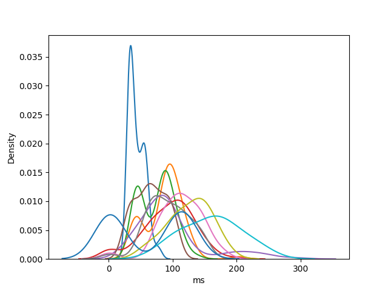

---

### coc

**/data/buffers/2-medium.txt**

| Key         | Value                        |
| ----------- | ---------------------------- |
| Completions | 75  |
| Mean        | 69ms |
| STD         | 62ms  |
| Q0          | 2ms   |
| Q50         | 112ms  |
| Q95         | 139ms  |
| Q100        | 160ms |

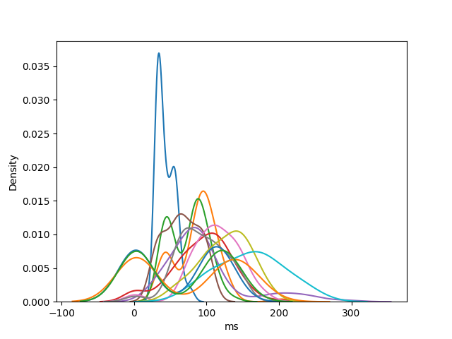

---

### coc

**/data/buffers/3-long.txt**

| Key         | Value                        |
| ----------- | ---------------------------- |
| Completions | 83  |
| Mean        | 75ms |
| STD         | 68ms  |
| Q0          | 2ms   |
| Q50         | 120ms  |
| Q95         | 156ms  |
| Q100        | 176ms |

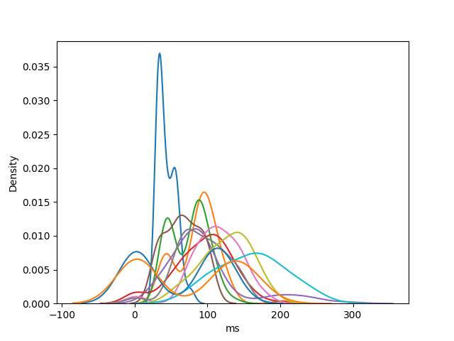

---

### coc

**/data/lsp/coq_nvim/coq/server/edit.py**

| Key         | Value                        |
| ----------- | ---------------------------- |
| Completions | 78  |
| Mean        | 61ms |
| STD         | 56ms  |
| Q0          | 2ms   |
| Q50         | 105ms  |
| Q95         | 123ms  |
| Q100        | 163ms |

---

### coc

**/data/lsp/create-react-app/packages/create-react-app/createReactApp.js**

| Key         | Value                        |
| ----------- | ---------------------------- |
| Completions | 87  |
| Mean        | 59ms |
| STD         | 57ms  |
| Q0          | 2ms   |
| Q50         | 8ms  |
| Q95         | 127ms  |
| Q100        | 130ms |

---

### coq

**/data/buffers/1-short.txt**

| Key         | Value                        |
| ----------- | ---------------------------- |
| Completions | 68  |
| Mean        | 45ms |
| STD         | 13ms  |
| Q0          | 30ms   |
| Q50         | 42ms  |
| Q95         | 71ms  |
| Q100        | 82ms |

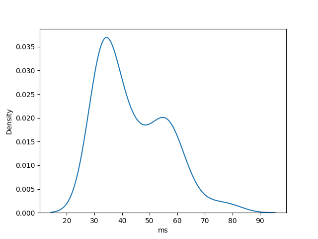

---

### coq

**/data/buffers/2-medium.txt**

| Key         | Value                        |
| ----------- | ---------------------------- |
| Completions | 79  |
| Mean        | 77ms |
| STD         | 23ms  |
| Q0          | 40ms   |
| Q50         | 85ms  |
| Q95         | 107ms  |
| Q100        | 117ms |

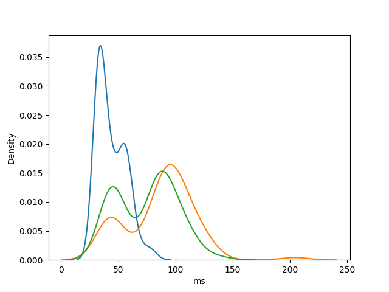

---

### coq

**/data/buffers/3-long.txt**

| Key         | Value                        |
| ----------- | ---------------------------- |
| Completions | 85  |
| Mean        | 88ms |
| STD         | 29ms  |
| Q0          | 1ms   |
| Q50         | 95ms  |
| Q95         | 121ms  |
| Q100        | 161ms |

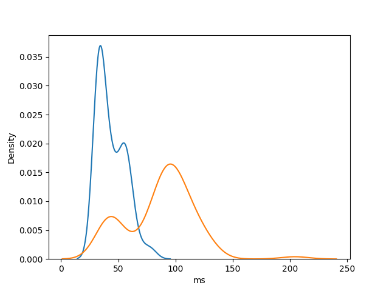

---

### coq

**/data/lsp/coq_nvim/coq/server/edit.py**

| Key         | Value                        |
| ----------- | ---------------------------- |
| Completions | 89  |
| Mean        | 105ms |
| STD         | 39ms  |
| Q0          | 1ms   |
| Q50         | 103ms  |
| Q95         | 162ms  |
| Q100        | 241ms |

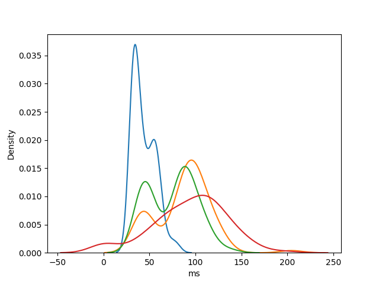

---

### coq

**/data/lsp/create-react-app/packages/create-react-app/createReactApp.js**

| Key         | Value                        |
| ----------- | ---------------------------- |
| Completions | 92  |
| Mean        | 83ms |
| STD         | 46ms  |
| Q0          | 36ms   |
| Q50         | 76ms  |
| Q95         | 154ms  |
| Q100        | 254ms |

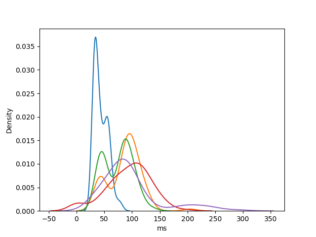

